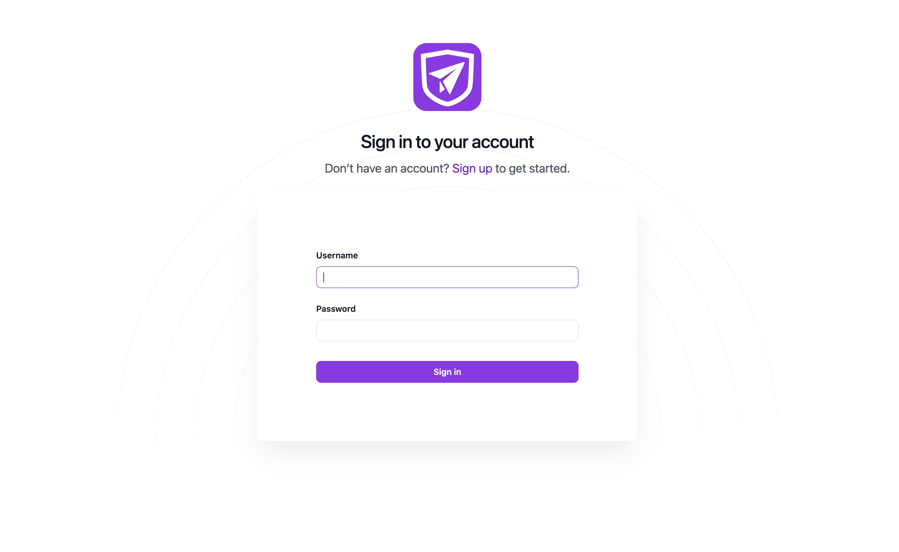
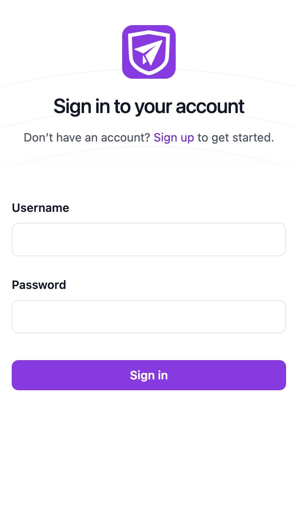
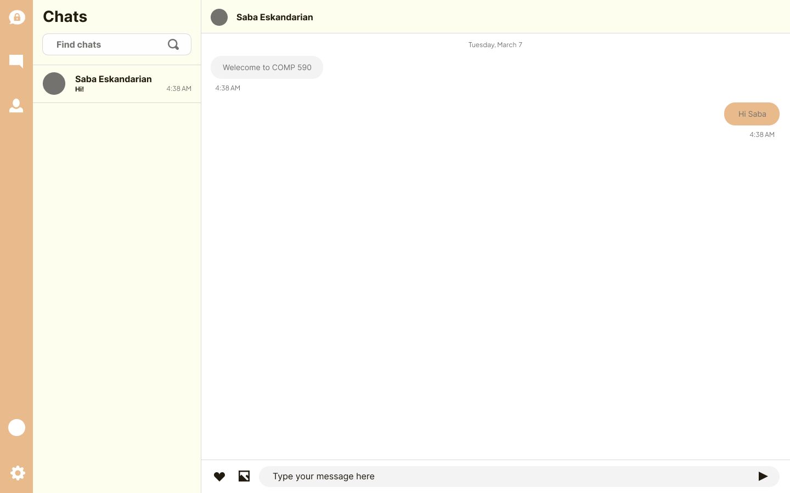

<!-- # Saba Secrets -->
<div align="center">

<h1 style="font-size:3rem;font-weight:700;">🔒 Saba Secrets 🔒</h1>
<br>
</div>

This is a prototype of a full-stack, web-based E2EE messaging application based on the [T3 Stack](https://create.t3.gg/).


<!--   -->



## Installation and setup

The _easiest_ and least bug-prone way to manage commits, branches, and PRs will be through [GitHub Desktop](https://desktop.github.com/) - it is strongly recommended to get accustomed to the GUI. You can [clone and manage repositories](https://docs.github.com/en/desktop/contributing-and-collaborating-using-github-desktop/adding-and-cloning-repositories/cloning-a-repository-from-github-to-github-desktop) directly via the application.


### Extensions & Formatting

Before modifying code, make sure you have the [ESLint](https://eslint.org/), [Prettier](https://prettier.io/), and [Prisma](https://www.prisma.io/) extensions. We will be working primarily in [TypeScript](https://www.typescriptlang.org/), so we should not have new files in any other language. Ideally, we would want to have everything formatted on save - this should be done automatically for you via VSCode's workspace settings (set in `.vscode/settings.json`), so if you're _not_ using VSCode, or if autoformatting is _not_ working, please make sure you have the following equivalent settings enabled in your IDE (can modify directly in `settings.json`):

```json
{
  "editor.formatOnSave": true,
  "editor.codeActionsOnSave": {
    "source.organizeImports": true
  },
  "editor.defaultFormatter": "esbenp.prettier-vscode",
  "[prisma]": {
    "editor.defaultFormatter": "Prisma.prisma"
  },
  "[html]": {
    "editor.defaultFormatter": "vscode.html-language-features"
  }
}
```

### Version & Package Managers

We will be giving preference for nvm and pnpm to manage Node versions and packages:

- <https://github.com/nvm-sh/nvm> (note you may have to use a separate version for Windows systems)
- <https://pnpm.io/installation>

The current Node LTS is 18.15, please install and set if not done so.
See 'Deeper Shell Integration' to automatically invoke with .nvmrc (YMMV on Windows)
<https://github.com/nvm-sh/nvm#deeper-shell-integration>

```bash
nvm install 18.15
nvm use 18.15
```

Additionally, please enable corepack if you have not yet done so - this will automatically standardize the pnpm versions across machines via the `packageManager` field in `package.json`. More information here: <https://pnpm.io/installation#using-corepack>

```bash
corepack enable

# Give preference to pnpm for faster boot, but npm and yarn are supported
pnpm install
```

Then, you may run the development runtime:

```bash
pnpm dev
```

### Environment Variables

Fill in environment files in a `.env` file (note a .env.example is provided - we may share keys separately, but this will be necessary later):

```
NEXT_PUBLIC_SUPABASE_URL= < YOUR SUPABASE URL >
NEXT_PUBLIC_SUPABASE_API_KEY= < YOUR SUPABASE ANON KEY >
```

### Contributing

Please create a separate feature branch for each individual feature/bugfix/update you work on, and make them as modular as possible (in other words, try to keep the number of files interacted low per branch). Be sure to commit often and have descriptive names for commits - this is easiest to do via GitHub Desktop. [See more on git best practices](https://gist.github.com/luismts/495d982e8c5b1a0ced4a57cf3d93cf60).

**NOTE**: As the main branch will be protected, you will _not_ be able to merge directly into `main`. You _must_ create a new branch for each feature you work on and submit a pull request once that is finished. Once your PR is reviewed and approved, you will then be able to merge it in. Once this is hosted, CI/CD will be primarily done automatically via Vercel and GitHub Actions.

## Create T3 App

This is a [T3 Stack](https://create.t3.gg/) project bootstrapped with `create-t3-app`.

If you are not familiar with the different technologies used in this project, please refer to the respective docs.

- [Next.js](https://nextjs.org)
- [NextAuth.js](https://next-auth.js.org)
- [Prisma](https://prisma.io)
- [Tailwind CSS](https://tailwindcss.com)
- [tRPC](https://trpc.io)
- [Supabase](https://supabase.com/)

## Learn More

To learn more about the [T3 Stack](https://create.t3.gg/), take a look at the following resources:

- [Documentation](https://create.t3.gg/)
- [Learn the T3 Stack](https://create.t3.gg/en/faq#what-learning-resources-are-currently-available) — Check out these awesome tutorials

You can check out the [create-t3-app GitHub repository](https://github.com/t3-oss/create-t3-app) — your feedback and contributions are welcome!

## How do I deploy this?

Follow our deployment guides for [Vercel](https://create.t3.gg/en/deployment/vercel), [Netlify](https://create.t3.gg/en/deployment/netlify) and [Docker](https://create.t3.gg/en/deployment/docker) for more information.
